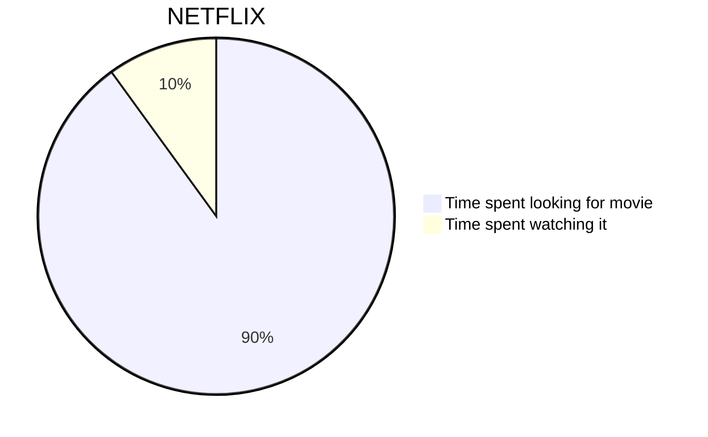
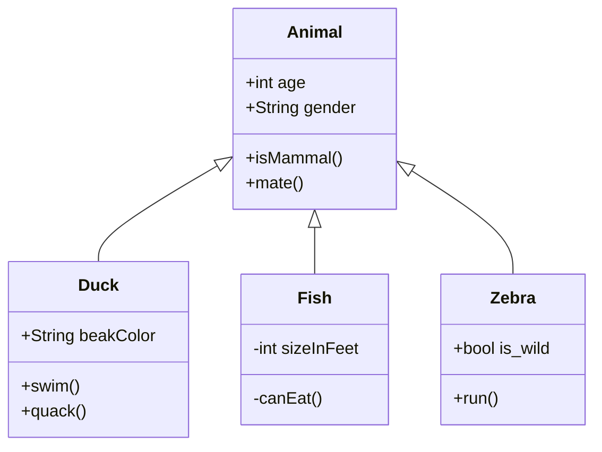
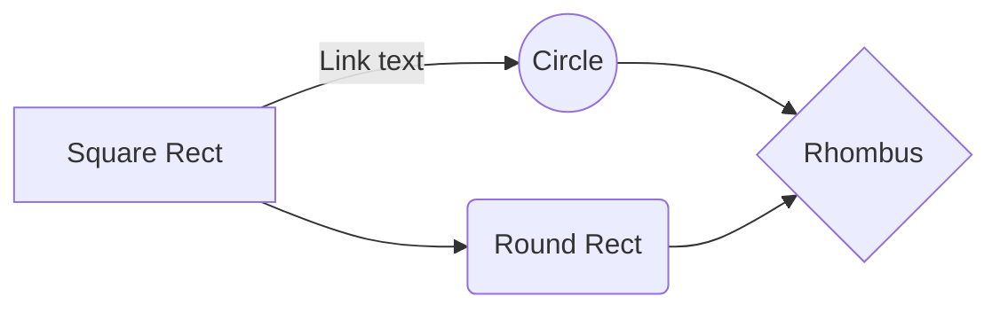

Within a section, every file that is **not** named `index.mdx` represents a lecture. You configure lecture names via the
frontmatter `title` attribute, and the lecture sequence (within that section) via the `number` frontmatter attribute.

Example from this lecture


Lectures are written in markdown. You can embed code snippets and also Javascript code samples for evaluation in the
browser as show below:


```jsx
/** @jsx jsx */
import { jsx } from 'theme-ui';
import { MDXRenderer } from 'gatsby-plugin-mdx';
import Layout from './layout';
import TableOfContents from './table-of-contents';

const DocsPage = ({ page }) => (
  <Layout>
    <h1>{page.title}</h1>
    <MDXRenderer>{page.body}</MDXRenderer>
    <p
      sx={{
        color: 'muted',
        fontSize: 14,
        mt: 2,
        pt: 2,
        borderTop: t => `1px solid ${t.colors.muted}`,
      }}
    >
      This page was updated {page.updated}.
    </p>
    <TableOfContents />
  </Layout>
);

export default DocsPage;
```

```js
function helloWorld() {
  return "A JS Function"
}
```

```python
def example_function() -> str:
    return "A Python Function"
```

```java
class Main {
  public static void main(String[] args) {

    // create int variable
    int num1 = 36;
    int num2 = 99;

    // convert int to string
    // using valueOf()
    String str1 = String.valueOf(num1);
    String str2 = String.valueOf(num2);

    // print string variables
    System.out.println(str1);    // 36
    System.out.println(str2);    // 99
  }
}
```

```yaml
- name: Chris Samiullah
  subtitle: Human
  author_image: "./assets/chris_samiullah.jpg"
```

## Math
#### Inline $a^2 + b^2 = c^2$


#### Block

$$
a^2 + b^2 = c^2
$$

$$
\frac{f}{Z} = \frac{x}{X} \leftrightarrow x = \frac{fX}{Z}
$$


## Sequence Diagrams
```sequence
Andrew->China: Says Hello
Note right of China: China thinks\nabout it
China-->Andrew: How are you?
Andrew->>China: I am good thanks!
```

## SVG Digrams
```bob-svg
 o-> Statistical charts


    E +-------------------------*--+     E |                         o
    D |-------------------*--*--|--*     D |                   o  o  |  o
    C |-------------*--*  |  |  |  |     C |             o  o  |  |  |  |
    B |-------*--*  |  |  |  |  |  |     B |       o  o  |  |  |  |  |  |
    A +-*--*--+--+--+--+--+--+--+--+     A +-o--o--|--|--|--|--|--|--|--|
        5 10 15 20 25 30 35 40 45 50         5 10 15 20 25 30 35 40 45 50
```


## Charts (via mermaid.js)



#### Class Diagram



#### Sequence Diagram



## Live code

```jsx react-live
() => (
  <div>
    <h1>A button!</h1>
    <button onClick={() => alert('clicked!')}>Click me</button>
  </div>
);
```